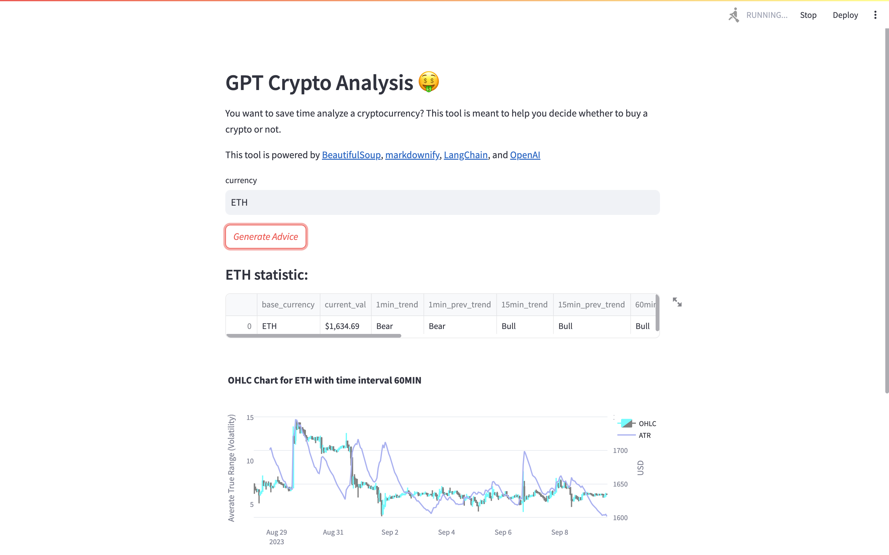
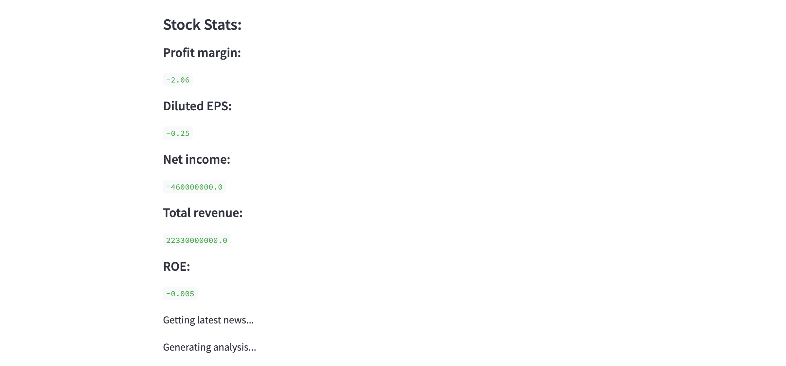
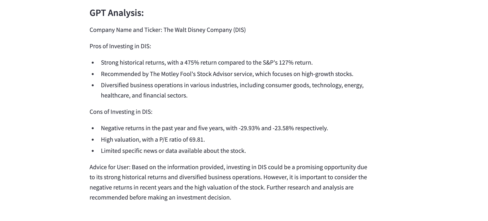

# GPT_Stock_Analysis
  I want to save time analyzing stocks.  This tool is meant to provide information to help you in investing stocks.            

## Abstract
Give GPT a stock ticker. 
It will: 
- Grab the latest 6 latest news from Google.
- Provide the latest 5-day stock price from Yahoo Finance.
- Provide the latest quarterly finance statement metrics: Total revenue, Net income, Diluted EPS, ROE, and Profit margin. 
- Provide 3 positive and 3 negative reasons to invest in the company.
- A conclusion will then be made considering the above information.  

## Example 
Input: DIS 

